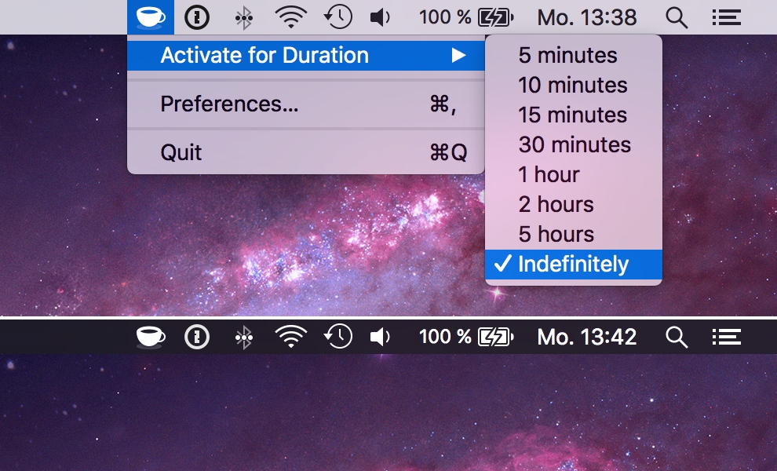

# KeepingYouAwake #

## A *Caffeine* clone for OS X Yosemite (and Dark Mode). ##

*KeepingYouAwake* is a small menu bar utility for OS X Yosemite (10.10) and above that can be activated to prevent your Mac from going into sleep.

You can toggle the state directly from your menu bar.

## Installation

**[Download the latest version here.](https://github.com/newmarcel/KeepingYouAwake/releases)**

or install it via [cask](http://caskroom.io/): `brew cask install keepingyouawake`.

## Why does this project exist, Caffeine.app works perfectly fine? ##

*[Caffeine](http://lightheadsw.com/caffeine/)* from *Lighthead Software* is a great utility and I used it for many years, but it hasn't been updated in a while. Its icons are not Retina-compatible and do not look nice in Yosemite's dark menubar mode.

## How do you prevent my Mac from sleeping? ##

This utility is just a small wrapper around Apple's caffeinate command line utilty. Any modern Mac ships this tool by default. You can read the manpage [here](https://developer.apple.com/library/mac/documentation/Darwin/Reference/ManPages/man8/caffeinate.8.html).

## Is this dangerous? ##

Just to make it clear: this utility shouldn't harm your Mac because it is using an official command line tool from Apple, **BUT** I cannot guarantee anything, so use this tool **AT YOUR OWN RISK**.

## Help Needed! ##

Do you want to improve the app or add any useful features? Please go ahead and create pull requests. I'm thankful for any help.

## Building the Source Code ##

*KeepingYouAwake* uses [Carthage](https://github.com/Carthage/Carthage) as dependency manager. You can install Carthage with [Homebrew](http://brew.sh). Type `brew update && brew install carthage` and call `carthage bootstrap` in the *KeepingYouAwake* source code folder to download and build all dependencies.

## Disclaimer ##

This is my first Mac application in a long while. I am an iOS developer and don't know the AppKit APIs very well, so please bear with me.

## License ##

Everything in this project is licensed under the [MIT license](http://opensource.org/licenses/MIT). I even included the Sketch files for all image assets in this project.

### The MIT License (MIT) ###

Copyright (c) 2014 – 2016 Marcel Dierkes

Permission is hereby granted, free of charge, to any person obtaining a copy
of this software and associated documentation files (the "Software"), to deal
in the Software without restriction, including without limitation the rights
to use, copy, modify, merge, publish, distribute, sublicense, and/or sell
copies of the Software, and to permit persons to whom the Software is
furnished to do so, subject to the following conditions:

The above copyright notice and this permission notice shall be included in
all copies or substantial portions of the Software.

THE SOFTWARE IS PROVIDED "AS IS", WITHOUT WARRANTY OF ANY KIND, EXPRESS OR
IMPLIED, INCLUDING BUT NOT LIMITED TO THE WARRANTIES OF MERCHANTABILITY,
FITNESS FOR A PARTICULAR PURPOSE AND NONINFRINGEMENT. IN NO EVENT SHALL THE
AUTHORS OR COPYRIGHT HOLDERS BE LIABLE FOR ANY CLAIM, DAMAGES OR OTHER
LIABILITY, WHETHER IN AN ACTION OF CONTRACT, TORT OR OTHERWISE, ARISING FROM,
OUT OF OR IN CONNECTION WITH THE SOFTWARE OR THE USE OR OTHER DEALINGS IN
THE SOFTWARE.
