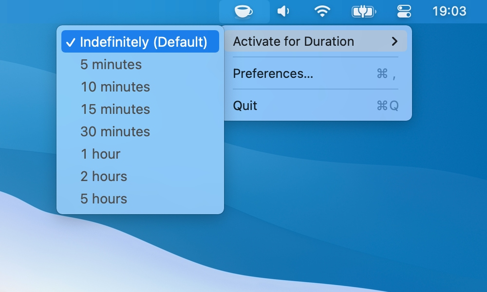

# KeepingYouAwake

KeepingYouAwake is a small menu bar utility for macOS *(Version 10.12 and newer)* that can prevent your Mac from entering sleep mode for a predefined duration or as long as it is activated.

https://keepingyouawake.app/

## Installation

**[Download the latest version here.](https://github.com/newmarcel/KeepingYouAwake/releases/latest)**

or install it via [cask](http://caskroom.github.io/): `brew cask install keepingyouawake`.

## How does it work?

The app is a small wrapper around Apple's `caffeinate` command line utility. All current versions of macOS ship with this tool by default. You can read the manual page [here](https://web.archive.org/web/20140604153141/https://developer.apple.com/library/mac/documentation/Darwin/Reference/ManPages/man8/caffeinate.8.html).

## Is this dangerous?

This utility will not harm your Mac because it is based on an official command line tool by Apple. **BUT** I cannot guarantee anything, so use this tool **AT YOUR OWN RISK**.

## Inspired by Caffeine

*KeepingYouAwake* is inspired by *[Caffeine](http://lightheadsw.com/caffeine/)* from *Lighthead Software*. I used it for many years, but sadly it hasn't been updated in a while. Eventually in 2014 I decided to build a replacement for myself that was optimized for macOS Yosemite and used the [`caffeinate`](https://web.archive.org/web/20140604153141/https://developer.apple.com/library/mac/documentation/Darwin/Reference/ManPages/man8/caffeinate.8.html) command line tool under the hood.

## Help Wanted!

Do you want to improve the app or add useful features? Please go ahead and create pull requests. I'm thankful for any help.

## Building the Source Code

*KeepingYouAwake* uses [Sparkle](https://github.com/sparkle-project/Sparkle/tree/ui-separation-and-xpc)'s `ui-separation-and-xpc` branch to deliver updates. You can build and sign Sparkle with `make Vendor`. To build a release version of the app just run `make dist`.

## License

Everything in this project is licensed under the [MIT license](http://opensource.org/licenses/MIT). Provided image assets are also covered by this license.

*Although it's not required please do not redistribute forked versions of the app with the same name and icon. Thanks!*
